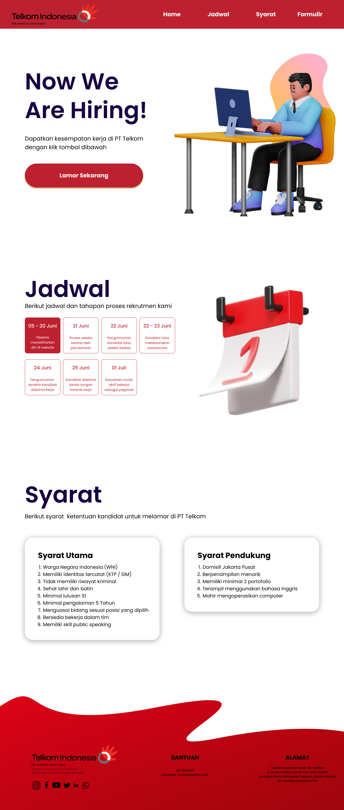

<a href="https://aimeos.org/">
    
</a>

# - Telkom Company

Website ini kami kembangkan untuk memenuhi permintaan kebutuhan terhadap karyawan profesional yang ada di perusahaan kami

---

# - Tim Pengembang

```diff
- - Atharafi Surya Affandy    ==> Web Developer & Web Programmer
+ - Destia Wulan Fatmalasari  ==> UI Designer & Dokumentator
! - Fahri Maulana Al Ghazali  ==> UI Designer & Design Conceptor
# - Nabila Farahana           ==> UX Designer & Tester
```

---

# - Bahasa Pemrograman dan Teknologi

Berikut ini adalah bahasa pemrograman dan teknologi maupun library yang ada pada website ini

     - HTML
     - CSS
     - JS
     - TailwindCSS
     - NodeJS
     - AnimeJS
     - JQuery
     - SweetAlert2
     - ValidateJS
     - Validator

---

# - Preview Halaman Utama

[](http://typo3.demo.aimeos.org/)

---

## Links Dokumentasi Maupun Project

<iframe style="border: 1px solid rgba(0, 0, 0, 0.1);" width="800" height="450" src="https://www.figma.com/embed?embed_host=share&url=https%3A%2F%2Fwww.figma.com%2Ffile%2Fhi0JFWkuKQbLd3h48okuoO%2FUntitled%3Fnode-id%3D2%253A4" allowfullscreen></iframe>

- [Web site](https://aimeos.org/integrations/typo3-shop-extension/)
- [Documentation](https://aimeos.org/docs/TYPO3)
- [Design](https://www.figma.com/file/hi0JFWkuKQbLd3h48okuoO/Untitled?node-id=2%3A4)
- [Issue tracker](https://github.com/aimeos/aimeos-typo3/issues)
- [Source code](https://github.com/aimeos/aimeos-typo3)
